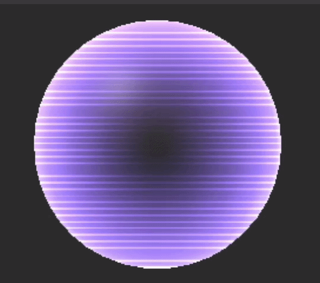
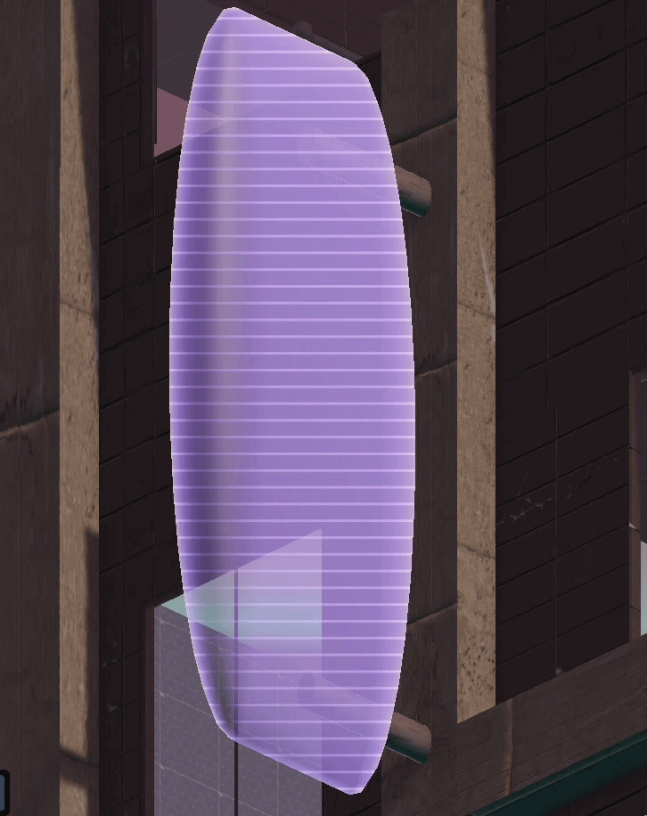
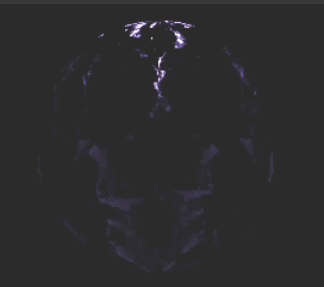
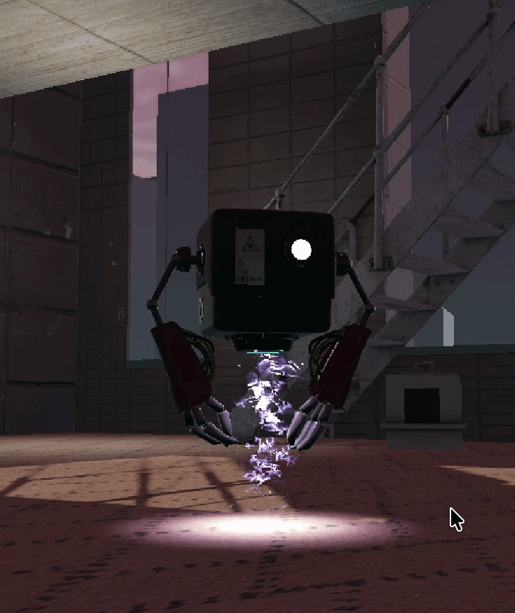

# Unity Shaders

**Three Shader Graph shaders and one particle system**, built for my own Unity projects.
Kept here so I can reuse them instead of rebuilding them each time — and so anyone
curious can see what they look like and how they're put together.

**Unity 6** · Universal Render Pipeline · Shader Graph 17.0.3

| | |
|---|---|
| **Shader Graph** | `Fire` · `Holographic` (+ `StripesHolo` subgraph) · `FireParticles` |
| **Particle system** | `FireParticleSystem` prefab + its material |
| **Hand-written (ShaderLab/HLSL)** | PS1 family · `ConcreteTriplanar` · `HeightFog` · `RetroDither` · `Hologram` · `MoveOutline` · `GradientSkybox` |

---

# Shaders

## 1. Fire

Turbulent flame surface — animated noise drives the flame shape, a colour ramp takes it
from deep violet through magenta to white-hot highlights. Meant to be applied to geometry,
not to particles.

`Assets/Shaders/Fire.shadergraph`

---

## 2. Holographic

Sci-fi hologram: horizontal scanlines, soft rim falloff and transparency, so it reads as
a projection rather than a solid. The scanline pattern lives in its own subgraph, so it
can be reused on other materials.

In a level, on a building:

`Assets/Shaders/HolographicShader.shadergraph` · `Assets/Shaders/StripesHolo.ShaderSubGraph`

---

## 3. Fire Particles

The particle-facing counterpart to the Fire shader — additive, driven by a flipbook and a
noise displacement map, and built to be rendered by a particle system rather than on a mesh.

`Assets/Shaders/FireParticles.shadergraph`

---

# Particle system

The Fire Particles shader above is what colours it; this prefab is what makes it move.
Emission curves, shape, lifetime and velocities are the part that actually makes it read
as a thruster jet.

`Assets/ParticleSystem/FireParticleSystem.prefab` · `Assets/ParticleSystem/FireParticlesMaterial.mat`

### Placeholder textures — swap these out

The two textures wired into the material are **placeholders**, included only so the
effect renders as soon as you import it:

| File | Slot | What to replace it with |
|---|---|---|
| `placeholder_noise.jpg` | `_DisplacementNoise` | any greyscale noise / turbulence map |
| `placeholder_fire_flipbook.png` | `_FireShapes` | any 5×5 flipbook sheet of flame or smoke |

They're stand-ins grabbed from around the web and are not mine to license — drop your own
in and the effect keeps working.

---

# Hand-written shaders (ShaderLab / HLSL)

Written for an in-development project of mine with a "PS1 geometry, modern lighting"
look. No Shader Graph here - plain ShaderLab with HLSL passes, URP forward path.

## The PS1 family

`PS1Lit` is the base: retro geometry artifacts on top of a full modern URP lit pass
(realtime shadows, additional lights, fog, ambient SH, emission). Two artifacts do the
work - vertices snap to a virtual low-res grid so the silhouette wobbles, and UVs are
interpolated without perspective correction so textures warp across triangles. Both are
dialled by `_VertexSnapPixels` and `_AffineAmount`, so you can go from subtle to full
1996.

| File | What it adds |
|---|---|
| `PS1Lit.shader` | the base lit shader |
| `PS1LitTransparent.shader` | alpha-blended version for glass and crystal parts |
| `PS1LitChromatic.shader` + `PS1LitChromaticPass.hlsl` | per-object chromatic aberration - two extra passes rewrite R and B shifted radially from screen center. Roughly 3x the raster cost, so it's for hero objects |

## Surfaces and atmosphere

| File | What it does |
|---|---|
| `ConcreteTriplanar.shader` | triplanar (box projection) PBR - textures are placed by world position, so no UV unwrap is needed. Handy on boolean-heavy meshes. Whiteout normal blending |
| `HeightFog.shader` | analytic exponential height fog with drifting density pockets; fullscreen pass that runs before post so bloom and grading treat fog as part of the scene |
| `GradientSkybox.shader` | sky gradient with a sun disc and horizon haze, dithered against banding |
| `RetroDither.shader` | posterize per channel + 4x4 Bayer ordered dithering, full resolution, no downscaling |

## Gameplay-facing

| File | What it does |
|---|---|
| `Hologram.shader` | placement ghost - additive fresnel and scrolling scanlines, tinted by the placer (blue valid / red invalid); also drives the beam ribbon |
| `MoveOutline.shader` | inverted-hull silhouette rim for a move/edit mode |

Both keep the PS1 vertex snap so they jitter in step with everything else.

## Notes before you drop these in

- They target **URP forward**. `HeightFog` and `RetroDither` are fullscreen passes and
  need a `FullScreenPassRendererFeature` on your renderer to do anything.
- `PS1LitChromatic` needs `PS1LitChromaticPass.hlsl` next to it.
- `Hologram` and `MoveOutline` expect their tint through a MaterialPropertyBlock; without
  one they still render, just in the default color.

## Using them

1. These target URP. Make sure the **Universal RP** and **Shader Graph** packages are
   installed in your project.
2. Copy the `.shadergraph` files — **with their `.meta` files** — into your `Assets/`.
   `HolographicShader` needs `StripesHolo.ShaderSubGraph` alongside it.
3. Create a material from each shader and assign it.
4. For the particle system, drag the prefab in — it already points at its material.

## License

MIT — the three shaders, the subgraph and the particle system are mine; use them, change
them, no attribution needed.

The two `placeholder_*` textures are **not** covered by that licence — they're web
stand-ins so the effect renders on import. Swap them for your own before shipping
anything.
