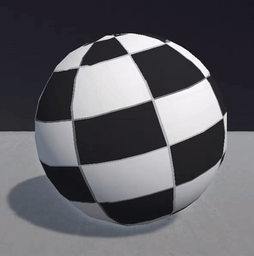
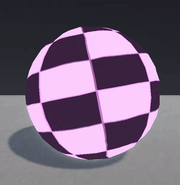
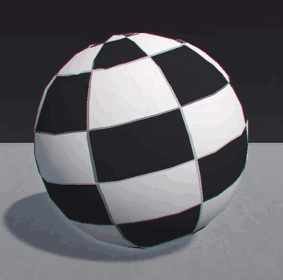
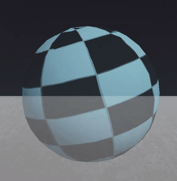
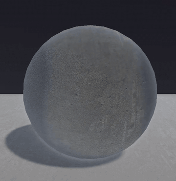
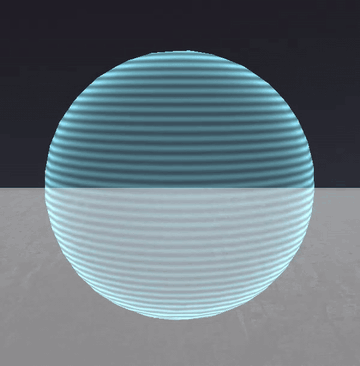
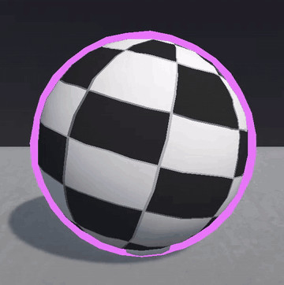

# Unity Shaders

**Three Shader Graph shaders, a particle system and a set of hand-written ShaderLab
shaders**, built for my own Unity projects. Kept here so I can reuse them instead of
rebuilding them each time — and so anyone curious can see what they look like and how
they're put together.

**Unity 6** · Universal Render Pipeline · Shader Graph 17.0.3

| | |
|---|---|
| **Shader Graph** | `Fire` · `Holographic` (+ `StripesHolo` subgraph) · `FireParticles` |
| **Particle system** | `FireParticleSystem` prefab + its material |
| **Hand-written (ShaderLab/HLSL)** | PS1 family · `ConcreteTriplanar` · `HeightFog` · `RetroDither` · `Hologram` · `MoveOutline` · `GradientSkybox` |

---

# Shaders

## 1. Fire

Turbulent flame surface — animated noise drives the flame shape, a colour ramp takes it
from deep violet through magenta to white-hot highlights. Meant to be applied to geometry,
not to particles.

`Assets/Shaders/Fire.shadergraph`

---

## 2. Holographic

Sci-fi hologram: horizontal scanlines, soft rim falloff and transparency, so it reads as
a projection rather than a solid. The scanline pattern lives in its own subgraph, so it
can be reused on other materials.

In a level, on a building:

`Assets/Shaders/HolographicShader.shadergraph` · `Assets/Shaders/StripesHolo.ShaderSubGraph`

---

## 3. Fire Particles

The particle-facing counterpart to the Fire shader — additive, driven by a flipbook and a
noise displacement map, and built to be rendered by a particle system rather than on a mesh.

`Assets/Shaders/FireParticles.shadergraph`

---

# Particle system

The Fire Particles shader above is what colours it; this prefab is what makes it move.
Emission curves, shape, lifetime and velocities are the part that actually makes it read
as a thruster jet.

`Assets/ParticleSystem/FireParticleSystem.prefab` · `Assets/ParticleSystem/FireParticlesMaterial.mat`

### Placeholder textures — swap these out

The two textures wired into the material are **placeholders**, included only so the
effect renders as soon as you import it:

| File | Slot | What to replace it with |
|---|---|---|
| `placeholder_noise.jpg` | `_DisplacementNoise` | any greyscale noise / turbulence map |
| `placeholder_fire_flipbook.png` | `_FireShapes` | any 5×5 flipbook sheet of flame or smoke |

They're stand-ins grabbed from around the web and are not mine to license — drop your own
in and the effect keeps working.

---

# Hand-written shaders (ShaderLab / HLSL)

Written for an in-development project of mine with a "PS1 geometry, modern lighting"
look. No Shader Graph here - plain ShaderLab with HLSL passes, URP forward path.

Same sphere, same light in every gif below, so they can be compared to each other and not
to a nice backdrop.

## PS1 Lit

The one everything else is built on. Vertices snap to a virtual low-res grid so the
silhouette wobbles when things move, and UVs skip perspective correction so textures warp
across long triangles. Under that it's a normal URP lit pass, so shadows, extra lights,
fog and emission all still work.

I keep `_VertexSnapPixels` at 240 and `_AffineAmount` at 1 for full 1996. Both dial down
if you want a hint of it instead, and zero on either turns that half off.

Same shader with HDR emission, if you have bloom in your stack:

`Assets/Shaders/PS1Lit.shader`

---

## PS1 Lit Chromatic

Colour fringing per object instead of across the whole screen. Two extra passes
(`PurrChromaR` and `PurrChromaB`) redraw the mesh with red and blue pushed apart, so the
thing I care about gets fringes and everything else in frame stays clean. They only run if
the renderer has a `RenderObjects` feature filtering for those two pass names - miss that
and this looks identical to plain PS1 Lit.

The shift grows towards the edges of the screen and is zero dead centre, like a real lens.
I spent a while cranking `_ChromaShift` up wondering why nothing was happening, on an
object parked in the middle of the frame. It's about 3x the raster cost, so I only use it
on things that matter.

`Assets/Shaders/PS1LitChromatic.shader` · `Assets/Shaders/PS1LitChromaticPass.hlsl`

---

## PS1 Lit Transparent

For glass and anything else you need to see through. Alpha blended, no depth write, alpha
comes off `_BaseColor`; snap and warp work the same as in the base shader.

`Assets/Shaders/PS1LitTransparent.shader`

---

## Concrete Triplanar

Box projection blended by the normal, so no UV unwrap. I wrote it for meshes that came out
of a stack of booleans and had no sane way to unwrap them. It follows the concrete
material I had in Blender: base colour times AO, lerped towards white, roughness into
smoothness, whiteout normals.

World projection by default, which is what you want on walls and floors - the texture
stays put and neighbouring meshes line up with no seam. The catch is that a spinning
object slides through a pattern that isn't moving, so it reads as standing still. Turn on
`_OBJECT_SPACE_TRIPLANAR` and the texture sticks to the mesh and turns with it, which is
what the gif shows. Don't use it on anything with lopsided scale, it smears along the long
axis.

`Assets/Shaders/ConcreteTriplanar.shader`

---

## Hologram

The ghost preview you get while placing something. Additive fresnel with scanlines
scrolling up world height; the placer tints it through a MaterialPropertyBlock, blue when
the spot is fine and red when it isn't. `_BeamMode` swaps the scanlines for pulses running
along the length, which is what I use on the LineRenderer beam.

`Assets/Shaders/Hologram.shader`

---

## Move Outline

Inverted hull, the old trick: draw the mesh again with front faces culled and vertices
pushed out along their normals, and all that survives the depth test is a rim. It goes in
a second material slot on top of the normal one. Same vertex snap as everything else, so
the rim jitters with the mesh instead of sliding around it.

`Assets/Shaders/MoveOutline.shader`

---

## Atmosphere and full-screen passes

Nothing to put on a sphere here, so no gifs.

`HeightFog.shader` - exponential height fog with drifting pockets of density. Runs before
post so bloom and grading treat it as part of the scene, and takes its colour from
`RenderSettings.fogColor`, so whatever drives your day/night cycle drives the fog too.
`_DensityMultiplier` is free for scripts; I use it to thin the fog out while the player is
indoors, otherwise the outdoor soup fills the rooms.

`RetroDither.shader` - posterize per channel plus a 4x4 Bayer pattern, full res, no
downscaling. It runs after post, so the film grade gets crushed along with everything
else. One thing I learned recording gifs of this: noise that changes on every pixel every
frame destroys GIF compression, and adding a second dither in the palette pass just
doubles the file size.

`GradientSkybox.shader` - zenith / horizon / ground gradient with a sun disc and haze,
dithered so it doesn't band.

## Notes before you drop these in

- They target **URP forward**. `HeightFog` and `RetroDither` need a
  `FullScreenPassRendererFeature` on your renderer, `PS1LitChromatic` needs a
  `RenderObjects` feature pointed at its two pass names, and without those they quietly
  do nothing.
- `PS1LitChromatic` needs `PS1LitChromaticPass.hlsl` next to it.
- `Hologram` and `MoveOutline` expect their tint through a MaterialPropertyBlock. Without
  one they still render, just in the default colour.

## Using them

1. These target URP. Make sure the **Universal RP** and **Shader Graph** packages are
   installed in your project.
2. Copy the `.shadergraph` files — **with their `.meta` files** — into your `Assets/`.
   `HolographicShader` needs `StripesHolo.ShaderSubGraph` alongside it.
3. The hand-written ones are plain `.shader` files, same deal — copy them with their
   `.meta`, and keep `PS1LitChromaticPass.hlsl` next to `PS1LitChromatic.shader`.
4. Create a material from each shader and assign it.
5. For the particle system, drag the prefab in — it already points at its material.

## License

MIT — the shader graphs, the subgraph, the particle system and the hand-written shaders
are all mine; use them, change them, no attribution needed.

The two `placeholder_*` textures are **not** covered by that licence — they're web
stand-ins so the effect renders on import. Swap them for your own before shipping
anything.
